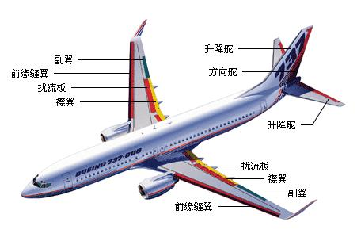
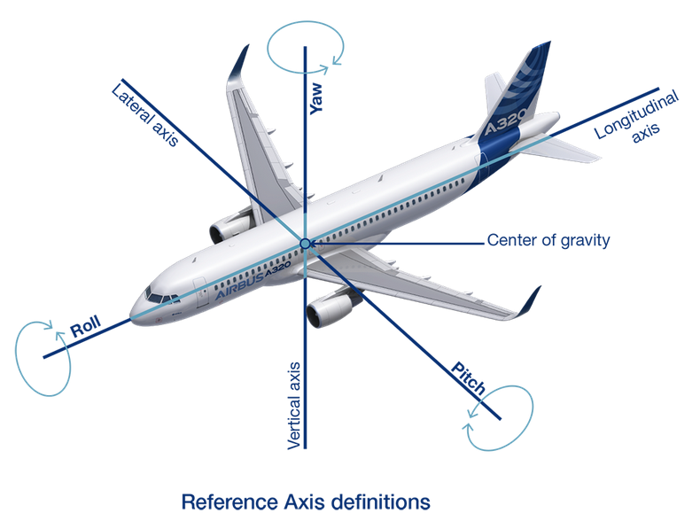

# 动作解释

---
**BTB（Bank to Bank）：**

BTB指飞机在配平后，将滚转角由0°偏转到一侧（一般30°），然后反向滚转至另一侧（-30°），最后再将滚转角回到0°。这是一个滚转特性的动作。

数据波动较大的列：1（时间）、5（滚转速率）、8（欧拉滚转角）、10（欧拉航向角）、15（副翼综合偏度）、24（左副翼偏转）、25（右副翼偏转）、27（动压）、30（海拔）、32（横向杆偏转）、75（y轴速度分量）、95、96、97、98、101（油量）、102（前罐组水配重质量）、103（后罐组水配重质量）、104（左油箱油量）、105（中间油箱油量）、106（右油箱油量）。

---

**LatR（Latitudinal Roll）：**

LatR是组合倍脉冲的缩写，先做一个方向舵倍脉冲（一种用于控制飞机、船只或其他交通工具方向舵的信号，特定的数字脉冲信号，以一定的频率和宽度发送到方向舵执行器，调整飞行器或船只的方向），等几秒，再做一个副翼倍脉冲（一种用于控制飞机或其他航空器副翼的信号，特定的数字脉冲信号，以一定的频率和宽度发送到副翼执行器，调整飞行器的横滚角度，帮助维持平稳的飞行）。这个动作是一个横航向组合动作，可充分激发飞机横航向特性。

数据波动较大的列：1（时间）、5（滚转速率）、8（欧拉滚转角）、10（欧拉航向角）、15（副翼综合偏度）、24（左副翼偏转）、25（右副翼偏转）、27（动压）、30（海拔）、32（横向杆偏转）、33（脚踏板偏转）、75（y轴速度分量）、101（油量）、104（左油箱油量）、105（中间油箱油量）、106（右油箱油量）。

---

**rdr3211（Rudder 3211）：**

rdr3211是方向舵“3211”动作，3211动作是方波信号，分别做3秒、2秒、1秒、1秒的方波。

方向舵“3211”动作是一种特定的数字脉冲信号，用于控制飞机方向舵。这个信号分别做3秒、2秒、1秒、1秒的方波，可以表示为以下数字序列：

- 3秒的方波：111000000
- 2秒的方波：110000
- 1秒的方波：10
- 1秒的方波：10

其中，数字 "1" 表示高电平，数字 "0" 表示低电平。每个方波的长度由相应的数字序列中 "1" 的数量和位置决定。这些方波信号将在相应的时间内被发送到方向舵执行器，以调整飞行器的方向。
数据波动较大的列：1（时间）、5（滚转速率）、8（欧拉滚转角）、10（欧拉航向角）、27（动压）、30（海拔）、33（脚踏板偏转）、75（y轴速度分量）、101（油量）、104（左油箱油量）、105（中间油箱油量）、106（右油箱油量）。

---

**rdr11（Rudder 11）：**

rdr11是方向舵倍脉冲。方向舵倍脉冲是一种用于控制飞机、船只或其他交通工具方向舵的信号，特殊的数字脉冲信号，以一定的频率和宽度发送到方向舵执行器，调整飞行器或船只的方向。

数据波动较大的列：1（时间）、5（滚转速率）、8（欧拉滚转角）、、27（动压）、30（海拔）、33（脚踏板偏转）、75（y轴速度分量）、101（油量）、104（左油箱油量）、105（中间油箱油量）、106（右油箱油量）。

---

**Lat3211（Lateral 3211）：**

Lat3211是副翼3211。副翼3211是一种特定的数字脉冲信号，用于控制飞机或其他航空器的副翼。它可以表示为以下数字序列：

- 3秒的方波：111000000
- 2秒的方波：110000
- 1秒的方波：10
- 1秒的方波：10

其中，数字 "1" 表示高电平，数字 "0" 表示低电平。每个方波的长度由相应的数字序列中 "1" 的数量和位置决定。这些方波信号将在相应的时间内被发送到副翼执行器，以调整飞行器的横滚角度，帮助维持平稳的飞行。

数据波动较大的列：1（时间）、5（滚转速率）、8（欧拉滚转角）、15（副翼综合偏度）、24（左副翼偏转）、25（右副翼偏转）、27（动压）、30（海拔）、32（横向杆偏转）、75（y轴速度分量）、101（油量）、104（左油箱油量）、105（中间油箱油量）、106（右油箱油量）。

---

**xtch（Coordinated Sideslip）：**

xtch是协调侧滑动作，协调侧滑是航向静稳定性的动作，亦称稳定直线侧滑飞行、定常侧滑飞行。

协调侧滑是指在飞行中，保持航向和机体相对空气流的方向一致，同时使机体侧滑角度为零的飞行状态。这种飞行状态被称为稳定直线侧滑飞行、定常侧滑飞行或者协调飞行。它是航向静稳定性的一种动作，可以帮助保持飞机的稳定性和平衡，同时减小飞机的阻力和燃油消耗。为了实现协调侧滑，需要通过控制方向舵、副翼和推力等手段来调整飞机的姿态和航向。

数据波动较大的列：1（时间）、8（欧拉滚转角）、10（欧拉航向角）、15（副翼综合偏度）、24（左副翼偏转）、25（右副翼偏转）、27（动压）、30（海拔）、33（脚踏板偏转）、34（油门-发动机#1）、35（油门-发动机#2）、75（y轴速度分量）、84、85、86、87（多功能扰流板）、95、96、97、98、101（油量）、104（左油箱油量）、105（中间油箱油量）、106（右油箱油量）。

---

**LonTrim（Longitudinal Trim）：**

LonTrim是纵向配平系统的一部分，用于调整飞机的俯仰姿态和保持稳定飞行。它通过控制飞机的水平尾翼（或称升降舵）来实现纵向配平。具体来说，LonTrim可以调整水平尾翼的角度，以产生所需的俯仰力矩，从而使飞机保持所需的纵向稳定性和飞行状态。在自动驾驶模式下，LonTrim通常由飞行控制计算机控制，而在手动控制模式下，则由飞行员使用相应的手柄或按钮来进行操作。

数据波动较大的列：1（时间）、8（欧拉滚转角）、10（欧拉航向角）、27（动压）、30（海拔）、31（纵向杆偏转）、34（油门-发动机#1）、35（油门-发动机#2）、101（油量）、104（左油箱油量）、105（中间油箱油量）、106（右油箱油量）。

---

**LonNz（Longitudinal Acceleration）：**

LonNz是纵向阶跃响应的一种度量，用于评估飞机在纵向加速度方向上的性能和响应特性。它通常表示为单位时间内纵向加速度的变化量，即单位时间内飞机垂直于地面方向的速度变化率。LonNz描述了飞机在垂直于地面的方向上，对控制输入的响应速度和敏感度。较高的LonNz值意味着飞机具有更快的纵向加速度和更敏捷的响应特性，适合进行空中战斗、激烈机动等高强度飞行任务，而较低的LonNz值则表示飞机的纵向性能较为平缓和缓慢，适合进行常规的巡航和运输任务。

数据波动较大的列：1（时间）、9（欧拉俯仰角）、27（动压）、30（海拔）、100（升降速率）、101（油量）、104（左油箱油量）、105（中间油箱油量）、106（右油箱油量）。

---

**LonStab（Longitudinal Stability）：**

LonStab是纵向机动稳定性动作，指不同滚转角下的稳定盘旋。LonStab是指在不同滚转角度下，保持飞机纵向稳定性和平衡的动作。它通常涉及到飞机的配重、飞行控制系统以及纵向表面等多个方面。通过合理的设计和调整，可以实现不同滚转角下的稳定盘旋和机动飞行。这种纵向机动稳定性动作对于飞机的安全和性能至关重要，可确保飞机在各种飞行条件下都具有足够的稳定性和控制性能，从而减小事故和故障的风险。

数据波动较大的列：1（时间）、8（欧拉滚转角）、10（欧拉航向角）、27（动压）、30（海拔）、101（油量）、102（前罐组水配重质量）、103（后罐组水配重质量）104（左油箱油量）、105（中间油箱油量）、106（右油箱油量）。

---

**Lon101（Longitudinal Control Signal 101）：**

Lon101是指纵向控制系统中的一种单脉冲信号，用于调整飞机的俯仰姿态。它通常由飞行控制计算机或者人工操作控制杆来产生，并且只在需要时才会发送到俯仰表面进行控制。

数据波动较大的列：1（时间）、27（动压）、30（海拔）、101（油量）、105（中间油箱油量）。

---

**PD和YD（Pitch Damper and Yaw Damper）：**

PD和YD分别是俯仰阻尼器（Pitch Damper）和偏航阻尼器（Yaw Damper）的简称。它们是现代飞机上常见的自动驾驶辅助设备，用于提高飞机的稳定性和控制性能。俯仰阻尼器可以通过调节俯仰表面的角度来抑制飞机的俯仰震荡和不稳定性，从而使飞机更加平稳和可控。偏航阻尼器则可以通过调节方向舵的角度来抑制飞机的偏航震荡和不稳定性，从而提高飞机的方向性和操纵性。

PD：俯仰阻尼器（Pitch Damper）
YD：偏航阻尼器（Yaw Damper）
OFF：关闭
